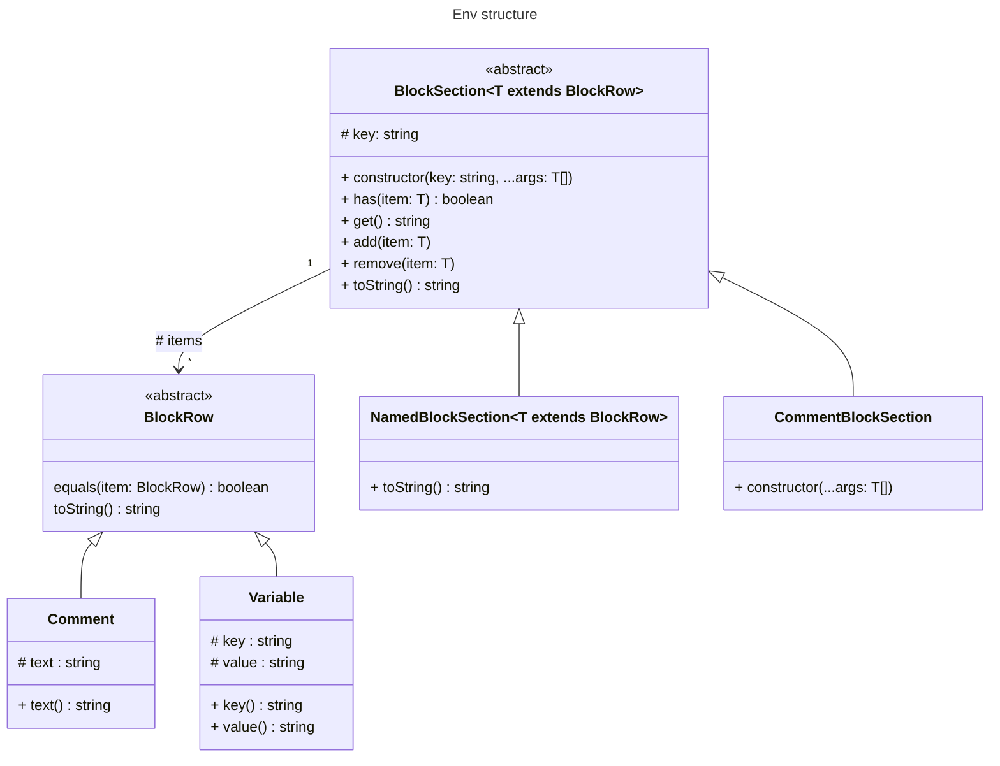

```mermaid
---
title: Env structure
---

classDiagram
    class BlockSection~T extends BlockRow~ {
        # key: string
        
        + constructor(key: string, ...args: T[])
        
        + has(item: T) boolean
        + get() string
        + add(item: T)
        + remove(item: T)
        + toString() string
    }
    class BlockRow {
        equals(item: BlockRow) boolean
        toString() string
    }
    class Variable {
        # key : string
        # value : string
        + key() string
        + value() string
    }
    class Comment {
        # text : string
        + text() string
    }
    class NamedBlockSection~T extends BlockRow~ {
        + toString() string
    }
    class CommentBlockSection {
        + constructor(...args: T[])
    }
    
    <<abstract>> BlockRow
    <<abstract>> BlockSection
    
    BlockRow <|-- Comment
    BlockRow <|-- Variable
    
    BlockSection <|-- NamedBlockSection
    BlockSection <|-- CommentBlockSection
    
    BlockSection "1" --> "*" BlockRow : # items
```
